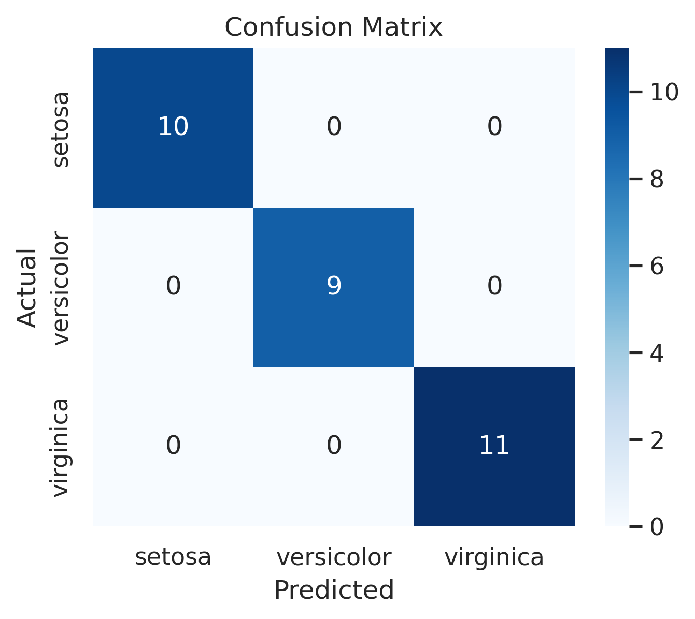
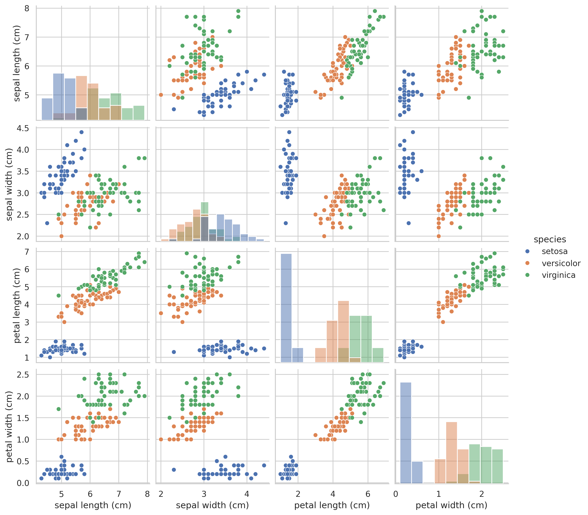

# Iris Flower Classification using Machine Learning

## 📌 Overview
This project builds a machine learning model to classify iris flower species (*Setosa*, *Versicolor*, *Virginica*) based on their sepal and petal measurements.  
It demonstrates basic data analysis, visualization, and classification techniques using **Python**.

---

## 🛠️ Technologies Used
- **Python**
- **Pandas**, **NumPy**
- **Scikit-learn**
- **Matplotlib**, **Seaborn**
- **Google Colab** (for execution)

---

## 📂 Dataset
- **Source**: Built-in `load_iris()` dataset from scikit-learn  
- **Features**:
  - Sepal length
  - Sepal width
  - Petal length
  - Petal width
- **Target**:
  - `Setosa`, `Versicolor`, `Virginica`

---

🔍 Steps Followed
1. Loaded the iris dataset from scikit-learn.
2. Converted it into a Pandas DataFrame.
3. Visualized feature relationships using **Seaborn Pairplot**.
4. Split data into training and testing sets.
5. Trained two models:
   - Logistic Regression
   - Decision Tree Classifier
6. Evaluated performance using **accuracy score**, **classification report**, and **confusion matrix**.
7. Visualized the confusion matrix as a heatmap.

---

## 📊 Results
- Achieved **high accuracy** for both models.
- Decision Tree achieved **100% accuracy** on the test set (due to dataset simplicity).
- Logistic Regression achieved over **96% accuracy**.

---

 ## 📸 Screenshots

### Confusion Matrix

### Pairplot

